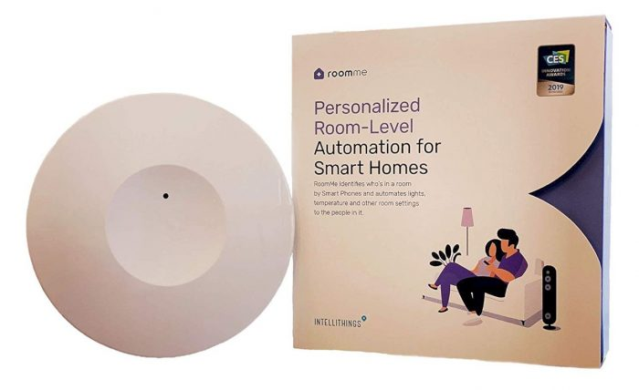
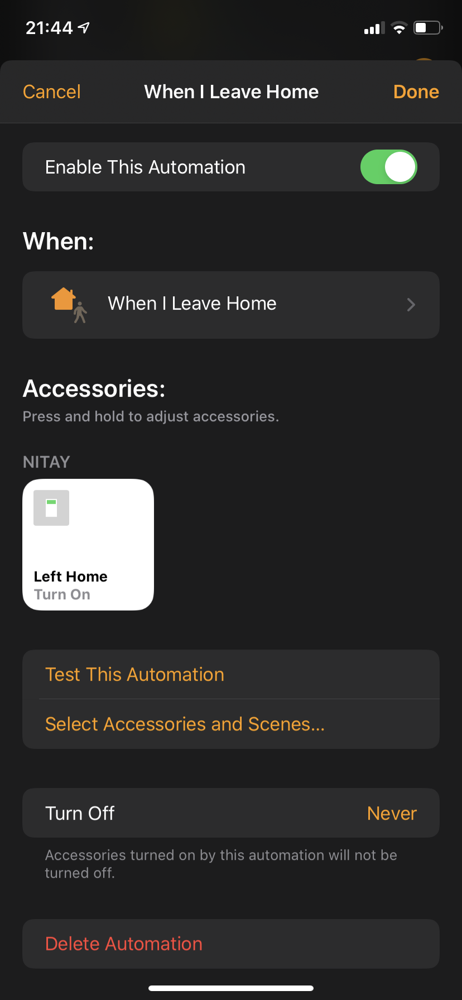
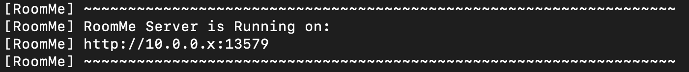

# homebridge-roomme

[](https://www.npmjs.com/package/homebridge-roomme)
[](https://www.npmjs.com/package/homebridge-roomme)<br>
[](https://github.com/homebridge/homebridge/wiki/Verified-Plugins) [](https://discord.gg/7DyabQ6)<br>
[](https://plugins.hoobs.org?ref=10876) [](https://support.hoobs.org?ref=10876)

**[Homebridge](https://github.com/nfarina/homebridge) plugin for roomme by Intellithings -<br>**
Specific people room level presence detection


  

### Requirements

 &nbsp;
<br>
\+ Static local IP for your HomeBridge/HOOBS machine.

check with: `node -v` & `homebridge -V` and update if needed

## Description

Specific user-room occupancy is finally here! **RoomMe by [Intellithings](https://www.intellithings.net/)** is a room occupancy sensor based on bluetooth communication with your mobile phones.
The plugin is creating a virtual http server that listens to RoomMe events (sent from your mobile devices) using their "RoomMe API Destination" feature/integration.

# Installation

This plugin support Homebridge UI and  is [HOOBS](https://hoobs.org/?ref=10876) certified and can be easily installed and configured through their UI.

1. Install homebridge using: `sudo npm install -g homebridge --unsafe-perm`
2. Install this plugin using: `sudo npm install -g homebridge-roomme`
3. Update your configuration file. See `config-sample.json` in this repository for a sample.
4. If you haven't installed RoomMe sensors already, follow the RoomMe Install guide [here](https://www.intellithings.net/setupintro) and install the sensors.
5. [Enable RoomMe API](##-Enable-RoomMe-API) from their app and connect it to HomeBridge. [click for more information](##-Enable-RoomMe-API).


## Config file

#### Easy config (default configurations)

```
"platforms": [
    {
        "platform": "RoomMe"
    }
]
```

#### Advanced config (optional)

```
"platforms": [
    {
        "platform": "RoomMe",
        "anyoneSensor": true,
        "leftHomeSwitch": true,
        "host": "0.0.0.0",
        "port": "13579",
        "secured": false,
        "sslKeyFile": "/path/to/ssl/key/file",
        "sslCertFile": "/path/to/ssl/certificate/file",
        "debug": true
    }
]
```
\* In order to get better understaning on the advanced features and the plugin in general, read more on [how the plugin works & it's limitations](##-How-the-plugin-works-+-limitations) and ["Advanced Server Configurations"](##Advanced-Server-Configurations)


### Configurations Table


|     Parameter    |                       Description                       | Required |  Default |   type   |
| :--------------: | :-----------------------------------------------------: |:--------:|:--------:|:--------:|
| `platform`       |   always "RoomMe"                                       |     ✓    |     -    |  String  |
| `anyoneSensor`   | When set to `true`, it creates an extra occupancy service on each room which represent "Anyone". It will trigger when someone is in the room and will turn off when no one is in the room. [read more here](###-Anyone-Sensor)     |   |  `false`  | Boolean |
| `leftHomeSwitch` |  When set to `true`, it creates a switch in HomeKit for each user. When turned ON, it will remove this user from the last room he has been detected in. [read more here](###-"Left-Home"-Switch)                              |   |  `false`  | Boolean |
| `host`           |  Hostname of the generated server.  [read more here](##Advanced-Server-Configurations)  |   | `0.0.0.0` |  String |
| `port`               |  Port of the generated server.  [read more here](##Advanced-Server-Configurations)  |   |  `13579`  |  String |
| `secured`    |  Creates HTTPS secure server with SSL certificate that you provide.                         |   |  `false`  | Boolean |
| `sslKeyFile` |  Path to your SSL key file. [read more here](##Advanced-Server-Configurations)          |     when using `secured`     |     -   |  String  |
| `sslCertFile`|  Path to your SSL certificate file. [read more here](##Advanced-Server-Configurations)  |     when using `secured`   |   -  |   String |
| `debug`      |  When set to `true`, the plugin will produce extra logs for debugging purposes.            |   |  `false`  | Boolean |


## How the plugin works + limitations

RoomMe plugin (like the device) is relying on your mobile devices for getting "occupancy detected" events for each user. whenever a user enters a room, their specific mobile device will send a call to this plugin to report "room entry" for that user.
The plugin is creating a local server to listen to those "events" and once connected to RoomMe app it creates an accessory for each room (RoomMe sensor) which includes occupancy services for each of the users from RoomMe app.
<br><br>
Because of this method, there are some limitations to the presence detection in HomeKit with some solutions:


### Local Network
1. **LIMITATION** - Since the plugin server is on local IP, the events will only trigger when your mobile devices are on the same WiFi network as HomeBridge and not on 3G/4G networks.

- **SOLUTION** - To make the plugin work outside your home network (in case your using 4G at home), you'll need to have an external static IP (or domain) with a port forwarding to the plugin port (default: 13579). This can be achieved through your Internet Service Provider (ISP) or via free Dynamic DNS Service like [no-ip](https://www.noip.com/) or [Cloudns](https://www.cloudns.net/aff/id/431407/). You can even use a service like [Ngrok](https://ngrok.com/) to create public URL and secure connection to your local machine.
<br>*you can read more on **Advanced Server Configurations** [here](##Advanced-Server-Configurations)

### Anyone Sensor

2. **LIMITATION** - RoomMe app can set automations based on users entering or leaving a room, but you don't have an automation to set when the first person enters the room or the last person leaves the room.

 - **SOLUTION** - Although this can be solved with complicated automations in HomeKit, I created an easy fix for that in the plugin. it creates an extra occupancy service on each room which represent "Anyone", It will trigger when someone is in the room and will turn off when no one is in the room. so now it's super east to create those "First person enter" or "Last person leave" based on that sensor.
 To enjoy this feature you'll have to enable it in the plugin settings (or config).

### "Left Home" Switch

3. **LIMITATION** - RoomMe knows which user is in which room and reports events on each entrance of a user to a room. The problem comes when you leave the house, that's where RoomMe fails to detect room exit. So in theory, if you leave the house, RoomMe will still consider you as present in the last room you've been in because the mobile device is not in range with the sensor to report exit.

 - **SOLUTION** - To make sure HomeKit is always in sync and your room occupancy detection is always accurate (*"turn off all sesnors for me when I leave home"*), I created the **"Left Home"** Switch. When enabled in the plugin settings (config), it will create a switch in HomeKit for each user. When turned ON, it will remove this user from the last room he has been detected in.<br>Once the switch is set up, you'll need to create an automation based on Home app geolocation (or any geolocation option you use in HomeKit) to turn ON this switch for a user when he leaves home.
 <br>example:<br>
 <br>
 *The switch will automatically shut off after 2 seconds


## Enable RoomMe API
RoomMe API is enabled by defining an External Link component on the RoomMe App (RoomMe API Destination). Once the External
Link is set, the app starts sending HTTP based updates to the set server address.

#### To enable during the initial setup of RoomMe:
1. At Smart Device Definition stage of the setup, select “RoomMe API Destination”. And click Next.
2. In the Remote Address field, enter the IP address / Hostname of the server where RoomMe will send room location updates. Usually you'll put here the IP address of your HomeBridge/HOOBS machine + plugin port (default is 13578). for example: "http://10.0.0.X:13579"
3. Click SAVE and follow the short sync process in the app.

#### To enable the API on an existing RoomMe setup:
1. Go to Settings -> Smart Devices.
2. select “RoomMe API Destination”. And click Next.
3. In the Remote Address field, enter the IP address / Hostname of the server where RoomMe will send room location updates. Usually you'll put here the IP address of your HomeBridge/HOOBS machine + plugin port (default is 13578). for example: "http://10.0.0.X:13579"
3. Click SAVE and follow the short sync process in the app.

The link to the server is also published in the console in this form:<br>
<br>
you can just copy-paste it from the console to RoomMe app

## Advanced Server Configurations

This plugin is creating a server using NodeJS built-in http and https libraries, therefore, I created a few extra options for advanced users to play with:

- **`host`** - change the hostname of the server (must be available before plugin initialization)
- **`port`** - change the port of the server.
- **`secured`** - creates https secured server. when using this option, cert and key files are required as the plugin will not create a self signed SSL certificate since it is not supported by the RoomMe app.
- **`sslKeyFile`** - path to your SSL key file (required when using the secured option!).
- **`sslCertFile`** - path to your SSL certificate file (required when using the secured option!).

\* Please update the link in RoomMe app if you change those settings after the initial configuration.

## Issues & Debug

If you experience any issues with the plugins or struggle with the configurations visit the [Issues](https://github.com/nitaybz/homebridge-roomme/issues) tab and check if your issue is already described there, if it doesn't, please create a new issue with as much detailed information as you can give (logs are crucial).<br>
if you want to even speed up the process, you can add `"debug": true` to your config, which will give me more details on the logs and speed up fixing the issue.

## Support Homebridge RoomMe

**homebridge-roomme** is a free plugin under the MIT license. it was developed as a contribution to the homebridge/hoobs community with lots of love and thoughts.
Creating and maintaining Homebridge plugins consume a lot of time and effort and if you would like to share your appreciation, feel free to "Star" or donate.

<a target="blank" href="https://www.paypal.me/nitaybz"></a><br>
<a target="blank" href="https://www.patreon.com/nitaybz"></a><br>
<a target="blank" href="https://ko-fi.com/nitaybz"></a>